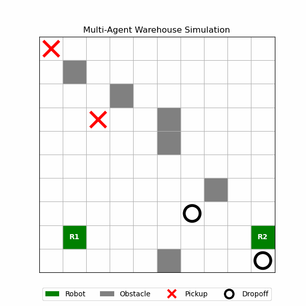

# Multi-Agent Warehouse Simulator

An evolving warehouse robotics simulator exploring multi-agent coordination, planner-based task allocation, and scalable robot cooperation architectures inspired by MAPF/PIBT-style planning systems.

## Current Features

- Grid-based warehouse environments with obstacles
- Goal-directed robot navigation
- Centralized multi-agent planner architecture
- Pickup/dropoff task workflows
- Autonomous task assignment and execution
- Priority-based robot coordination
- Reservation-based collision avoidance
- Live multi-agent visualization
- Oscillation mitigation using short-term robot memory that prevents backtracking

## Priority-Based Coordination Comparison

<table>
  <tr>
    <td align="center">
      
       
      <b>R1 prioritized</b>
    </td>
    <td align="center">
      
       
      <b>R2 prioritized</b>
    </td>
  </tr>
</table>

The robot priority ordering affects coordination dynamics, movement decisions, and overall task execution behavior.

## Future Directions

- Multi-robot coordination and conflict resolution
- PIBT-inspired planning behaviors
- Bio-inspired decentralized planning
- AI-driven coordination systems